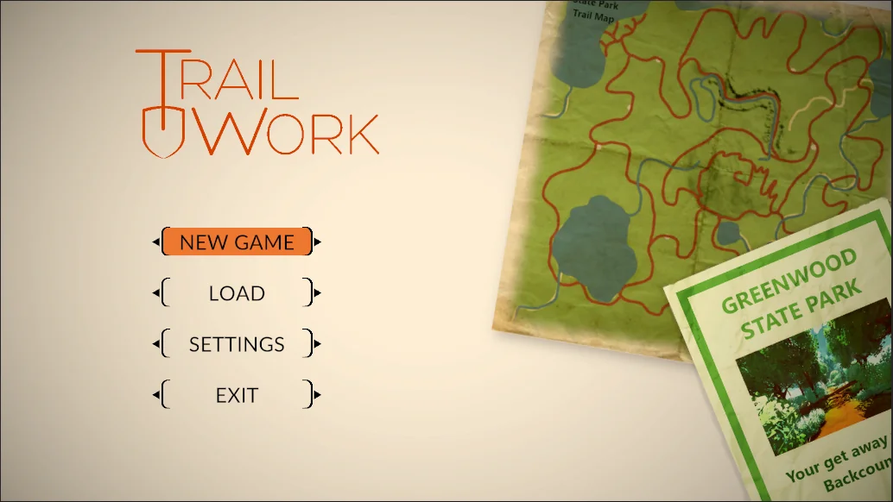

# 7 Building and interface

## In this file

- [Placement and movement](#placement-and-movement)
- [Undo and redo](#undo-and-redo)
- [Group operations](#group-operations)
- [Inventory and component settings](#inventory-and-component-settings)
- [Invalid placement](#invalid-placement)
- [Player presentation and tagging](#player-presentation-and-tagging)
- [Menus and inventory appearance](#menus-and-inventory-appearance)
- [Default controls](#default-controls)

## Placement and movement

Before placement, a semitransparent ghost shows the object’s position, orientation, pins, and complete footprint. The side from which the player approaches and aims at the placement cell determines the initial orientation; the player can move around the cell to choose another side. An already placed object may later rotate under the confirmed safe rotation rule in [Section 3](physical-connections.md). Players can target and interact with objects up to 15 blocks away. Walking, flying up and down, movement speeds, collision behavior, and the associated controls must match Minecraft Creative mode, including WASD movement, double-Space flight toggle, Space to rise, and Shift to descend while flying. This is a behavioral reference, not a dependency on or reuse of Minecraft code, and SiliconSandbox’s own world boundaries still apply. Every object and circuit may float without physical support. Existing world-size/boundary choices in the source design document remain relevant unless changed separately.

## Undo and redo

Undo defaults to U and Redo to J; both can be rebound. They behave like an IDE edit history and cover edits from the preceding five minutes. The five-minute history is saved with the world and remains available after closing and reopening. It is construction/edit history, not a request for full circuit-time rewind. Exact clock/timestamp semantics for a world left closed for longer than five minutes were not specified.

## Group operations

The two-corner region selection used for packaging also selects groups. After confirmation, the player can package, copy, and/or delete the selection. Paste uses the same complete-footprint preview and all-or-nothing free-space check as module expansion. There is no separate Move command; copy, delete, and paste provide the equivalent workflow. There is no general in-place replacement that preserves connections automatically; the player breaks an old object and places its replacement. A copied group contains the selected objects and internal connections. A connector cut by the selection boundary becomes an open end in the pasted group. It will not connect to nearby objects merely because it appears adjacent.

## Inventory and component settings

The inventory follows the Minecraft-style reference in the original design document: a nine-slot hotbar and 27 additional slots opened with E, with the cited Clean Hotbar visual style as a reference. The conversation did not fully design search, categories, favorites, or module organization; these remain open rather than inferred from Minecraft. The default C key, remappable in settings, opens Configure for the targeted component. Parameters include gate width, counter width, divider N, pulse duration, and initial source state. A setting that changes port layout or width auto-pauses and is refused while incompatible connectors remain attached; the player disconnects them first. Other settings also apply at a safe pause boundary. Editing startup configuration is different from changing a source’s current runtime value by right-click.

## Invalid placement

Use the shared, quiet invalid-action click/buzz and a single short red flash at the obstructed pin, channels, or occupied footprint. No recurring popup appears, even after repeated attempts. Multi-block actions never partially place. In Configure, an invalid field or overlapping bit range can instead turn red with a short inline explanation and disabled confirmation.

## Player presentation and tagging

The player character is provisionally three blocks tall, adjustable if needed. Show the held object at the bottom right of the screen. Outline the targeted ordinary block with a thin black box; the more specific pin and connector highlights in [Section 3](physical-connections.md) identify electrical targets. Placement can use another object or surface as a reference, and all objects may float.

F opens a sign-like text-entry interface for the targeted block, component, or module. Show its tag as a floating name inside a small contrast box. A wire’s tag appears at every end attached to a component or module; electrically continuous segments share one tag rather than separate segment names. Net Link link names remain distinct from ordinary labels.

The tagging interface also lets the player choose a wire identity color, including for Net Links. Save that color. Show it separately from the signal-state body under the accepted [connector color rule](physical-connections.md#connector-appearance), preserving the muted blue 0, bright green 1, pulsing red X, and gray Z meanings. Mixed-value harness appearance remains open until that later feature.

## Menus and inventory appearance

Menu button placement, ordering, and style must be easy to change without breaking the actions. The main menu includes New Game, which asks for world name and settings; Load Game, which lists saved world files; and Settings. Preserve the original illustrated menu reference, replacing its map-themed objects with 3D gate and component blocks. Inventory and hotbar appearance follow the original Clean Hotbar texture-pack reference at https://www.planetMinecraft.com/texture-pack/clean-hotbar-6460785/ . Detailed search, categories, favorites, and module organization remain open.

## Default controls

**First-playable right-click precedence, 30 September 2026:** The precise target under the crosshair determines the action. Right-clicking the body of a Constant Logic Source toggles its current runtime On/Off state even when a placeable item is selected. A separately targeted free pin on that source accepts placement of the selected connector under the normal pin-placement rules. Right-clicking an ordinary placement target places the selected item. This settles source-body use versus ordinary placement for the first playable; Shift-concatenation and other modifier conflicts remain separate later decisions.

**First-playable control bindings, 30 September 2026:** Default Z rotates the targeted placed component or module one 90-degree vertical-axis step clockwise as viewed from above; X rotates it one step counterclockwise. Both use the existing preview, safe pause, and confirmation rule. Default `[` advances one world-clock edge and `]` advances one complete world-clock cycle, settling all consequences before control returns. Expose the same step actions as labeled pause-screen buttons so they are usable without those keys. All four bindings remain remappable. Later pitch/roll controls and the Shift-concatenation conflict can be specified with their features.

| Input | Action |
| --- | --- |
| W, A, S, D | Move forward, left, backward, and right |
| Space | jump |
| Double tap space | fly |
| Left Ctrl | toggle Sprint |
| Left Shift | Sneak (prevents falling off edges) |
| Left Mouse Button | Attack or break blocks. |
| Right Mouse Button | Use items, place blocks, or open Interfaces. |
| Scroll Wheel / Keys 1–9 | Select hotbar items. |
| E | Open or close the inventory. |
| R | select first boundary block for Packaging |
| T | select second boundary block for Packaging |
| Enter/Return | Confirm Packaging bounding box |
| F | select block for tagging. |
| F1 | Hide or show the game interface (HUD). |
| F2 | Take a screenshot. |
| F3 | Open the debug screen. |
| Esc | Pause the game or exit screens |
| P | Start or stop the world clock. |
| Space while flying | Rise |
| Shift while flying | Descend |
| Shift plus right click | Momentary concatenate modifier during connector placement |
| C | Configure targeted component |
| I | Inspect targeted connector pin or component |
| U | Undo construction edit |
| J | Redo construction edit |
| Z / X | Preview clockwise / counterclockwise vertical-axis rotation of the targeted placed component or module; confirmation follows Section 3 |
| `[` / `]` | Advance one world-clock edge / one complete world-clock cycle while paused |

All bindings are configurable. R/T/Enter also serve group selection. The original Attack label on left-click does not add combat, mobs, or survival mechanics. Source-body use versus placement follows the rule above. Open: Shift flight/sneak and concatenation, and scroll-wheel hotbar selection versus crowded-connector cycling.

Original main-menu visual reference. Replace its maps with 3D logic-gate and component blocks.
